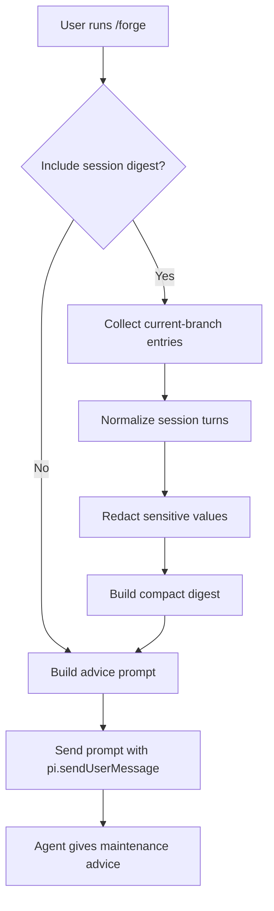

# Pi Forge Specification

Pi Forge is a Pi Coding Agent extension that asks the Pi agent how to maintain durable agent guidance.
It is invoked as a slash command and sends a short advice request instead of generating proposal files.

## Goals

- Ask for reusable project guidance based on the active conversation context.
- Optionally attach a redacted current-branch session digest when explicitly requested.
- Ask the Pi agent to advise on `AGENTS.md` and Agent Skill maintenance.
- Keep `/forge` itself read-only and free of generated proposal artifacts.
- Avoid promoting one-off session noise into durable guidance.

## Non-Goals For The MVP

- Automatically updating `AGENTS.md`.
- Automatically creating, deleting, or installing skills.
- Generating `summary.md`, `findings.json`, `AGENTS.patch`, or Skill draft files.
- Sending the full session to an external service without explicit configuration.
- Replacing human review of guidance changes.

## Default Decisions

- The default evidence source is the active conversation context.
- The default target is both `AGENTS.md` and Agent Skills.
- Pi Forge sends advice prompts through `pi.sendUserMessage()`.
- Pi Forge does not write files by default.
- Pi Forge does not include a session digest by default.

## Slash Command Interface

Pi Forge registers a single slash command:

```text
/forge [agents|skills|all] [--include-session] [--since <label-or-entry-id>]
```

The default mode is `all`, which asks for advice on both `AGENTS.md` and Skills.

Supported options:

- `agents`: only ask for `AGENTS.md` maintenance advice.
- `skills`: only ask for Agent Skill maintenance advice.
- `all`: ask for both guidance targets.
- `--include-session`: attach a redacted digest of the current session branch.
- `--since <label-or-entry-id>`: attach a redacted digest of entries after the matching label or entry id.

## User Flow



## Advice Prompt

The prompt sent to the agent includes:

- The active conversation context is the default evidence source.
- A redacted session digest with entry ids and roles only when `--include-session` or `--since` is used.
- The selected target: `all`, `agents`, or `skills`.
- Whether a session digest was included.
- Optional `since` filter.
- The redaction count.
- Instructions to inspect existing guidance before recommending changes.
- Instructions to advise only, not edit files immediately.

## Advice Categories

The agent should classify recommendations as:

- Update existing guidance.
- Create new guidance.
- Delete obsolete guidance.
- Merge duplicate guidance.
- No change.

## Acceptance Criteria

- `/forge` appears as a Pi slash command.
- The extension can read the current session through `ctx.sessionManager`.
- The extension normalizes user, assistant, tool result, and custom entries into a stable internal format.
- Secret-like values are redacted before sending the agent prompt.
- The extension calls `pi.sendUserMessage()` with the advice prompt.
- The extension does not create proposal files.
- The extension does not read session entries unless `--include-session` or `--since` is used.
